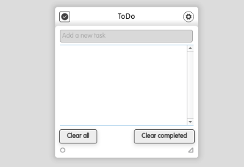
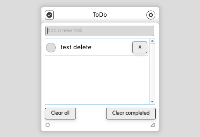
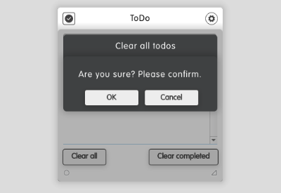
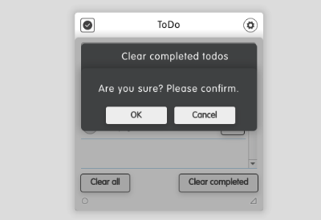

# to-do

**Table of contents**

1. Screenshots
2. Description
3. What is new in vX.Y.Z
4. Works well with
5. Additional information

## Screenshots

## Description

With this dizmo you can enter your todos in a list.
A new dizmo instance opens with an empty list.

Write with a keyboard a new task (eg. "test delete") in the textbox. Pressing return key, the text is put as a new item in the list.

Clicking the checkbox on the left, the item is marked as completed (checkbox is selected and text is crossed out).

Pushing the delete button ("x") on the right, the item is removed from the list.

Pushing the "Clear all" button removes all tasks (completed or not).
A confirmation dialog is displayed:

Pushing the "Clear completed" button only removes completed tasks.

## What is new

1.2.3: added help documentation

## Works well with

Is standalone. No reading/writing of stdout.

## Additional Information

* Developer: Martin Wirth
* Contact: support@dizmo.com
* Website: www.dizmo.com
